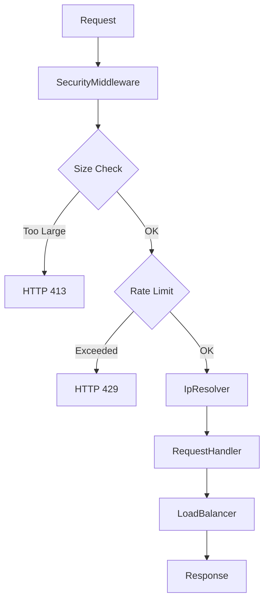

**Note:** Don't actually use this, this is intended to be nothing more than a personal deep dive into Load Balancers and OpenSwoole.

# PHP Load Balancer

A high-performance, PHP load balancer built with OpenSwoole and PHP-DI, featuring clean architecture, comprehensive security, and extensive testing.

## Features

### Core Functionality
- **Round-robin load balancing** - Thread-safe server selection with atomic operations
- **High-performance HTTP server** - Built on OpenSwoole for exceptional concurrency
- **Request correlation tracking** - UUID-based request IDs for distributed tracing
- **Graceful shutdown** - Proper signal handling (SIGTERM, SIGINT, SIGHUP)

### Security & DOS Protection
- **Request size limits** - Configurable protection against large upload attacks
- **Rate limiting middleware** - Per-IP sliding window rate limiting with automatic cleanup
- **Reverse proxy support** - X-Forwarded-For parsing with trusted proxy validation
- **CIDR network matching** - IPv4/IPv6 support for proxy trust relationships

### Architecture & Quality
- **Clean architecture** - Dependency injection, interfaces, and separation of concerns
- **Type safety** - Full PHP 8.4+ type declarations with readonly properties
- **Configuration validation** - Schema-based validation using Symfony Config component
- **Comprehensive testing** - 147 tests with 536+ assertions covering all components
- **RFC 9457 error responses** - Structured error details in debug mode

### Development Experience
- **Hot reload in development** - Automatic code reloading when files change
- **Docker support** - Containerized development environment with volume mounts
- **PSR-3 logging** - Structured logging with configurable levels and context interpolation
- **Code style enforcement** - PHP-CS-Fixer integration for consistent formatting

## Quick Start

1. **Clone and start the load balancer:**
   ```bash
   git clone <repository>
   cd php-load-balancer
   ./scripts/start.sh
   ```

2. **Access the load balancer:**
   ```
   http://localhost:9501
   ```

3. **Run tests:**
   ```bash
   ./scripts/test.sh
   ```

## Scripts

- `./scripts/start.sh` - Start the load balancer (with cache)
- `./scripts/start.sh --no-cache` - Start with fresh build (for new dependencies)
- `./scripts/start.sh -v` - Start with verbose output
- `./scripts/test.sh` - Run tests
- `./scripts/test.sh -v` - Run tests with verbose output
- `./scripts/cs.sh` - Check code style
- `./scripts/cs.sh --fix` - Fix code style issues

## Configuration

Configuration uses type-safe validation with the Symfony Config component, preventing typos and providing clear error messages.

### Core Settings

| Variable | Default | Description |
|----------|---------|-------------|
| `APP_ENV` | `production` | Environment (`development`, `testing`, `production`) |
| `APP_DEBUG` | `false` | Enable debug mode with detailed error responses |
| `SERVER_HOST` | `0.0.0.0` | Server bind address |
| `SERVER_PORT` | `9501` | Server port (1-65535) |
| `ENABLE_OUTPUT` | `true` | Enable request logging |
| `DEFAULT_SERVERS` | `` | Comma-separated backend servers |

### Security Settings

| Variable | Default | Description |
|----------|---------|-------------|
| `MAX_REQUEST_SIZE` | `1048576` | Maximum request size in bytes (1KB-100MB) |
| `RATE_LIMIT_ENABLED` | `true` | Enable rate limiting |
| `RATE_LIMIT_REQUESTS` | `100` | Requests per window |
| `RATE_LIMIT_WINDOW` | `60` | Window size in seconds |
| `TRUSTED_PROXIES` | `` | Comma-separated proxy IPs/CIDR ranges |
| `FORWARDED_HEADER` | `x-forwarded-for` | Header for forwarded IP addresses |
| `TRUST_FORWARDED_HEADERS` | `false` | Enable X-Forwarded-For parsing |

### Example Configuration

```env
# Core settings
APP_ENV=development
APP_DEBUG=true
SERVER_HOST=0.0.0.0
SERVER_PORT=9501
ENABLE_OUTPUT=true

# Backend servers
DEFAULT_SERVERS=http://api1:8080,http://api2:8080,http://api3:8080

# Security settings
MAX_REQUEST_SIZE=2097152  # 2MB
RATE_LIMIT_ENABLED=true
RATE_LIMIT_REQUESTS=1000
RATE_LIMIT_WINDOW=60

# Reverse proxy settings (for production behind nginx/cloudflare)
TRUSTED_PROXIES=10.0.0.0/8,172.16.0.0/12,192.168.0.0/16,103.21.244.0/22
TRUST_FORWARDED_HEADERS=true
FORWARDED_HEADER=x-forwarded-for
```

## Architecture

### Clean Architecture Layers

- **Domain Layer** (`src/Domain/`) - Core business logic and interfaces
  - `LoadBalancerInterface` with `RoundRobinLoadBalancer` implementation
  - Thread-safe server selection using OpenSwoole atomic operations
  - `NoHealthyServersException` for domain-specific error handling

- **Application Layer** (`src/Application/`) - HTTP server and request handling
  - `HttpServer` - OpenSwoole-based server with security middleware integration
  - `RequestHandler` - Coordinates request processing pipeline
  - `SecurityMiddleware` - DOS protection and rate limiting
  - `IpResolver` - Reverse proxy IP resolution with CIDR support
  - Response DTOs with RFC 9457 structured error fields

- **Infrastructure Layer** (`src/Infrastructure/`) - External system concerns
  - `Config` - Schema-validated configuration with Symfony Config
  - `ConsoleLogger` - PSR-3 compliant logger with context interpolation
  - `SystemClock` - Testable time abstraction

- **Support Layer** (`src/Support/`) - Cross-cutting utilities
  - `ResponseBuilder` - Standardized response creation with debug context

### Security Architecture



### Request Flow

1. **Security Validation** - Request size and rate limit checks before processing
2. **IP Resolution** - Resolve real client IP considering trusted proxies
3. **Request Metadata** - Extract into `RequestMeta` with correlation ID
4. **Load Balancing** - Thread-safe server selection with atomic operations
5. **Response Building** - Standardized JSON responses with RFC 9457 error details
6. **Structured Logging** - Request correlation and context preservation

## API

### Success Response

```json
{
  "success": true,
  "message": "Load balancer is working",
  "timestamp": "2025-01-15T10:30:45+00:00",
  "request_id": "a1b2c3d4-e5f6-7890-abcd-ef1234567890",
  "target_server": "http://api1:8080",
  "data": {
    "path": "/api/users",
    "method": "GET",
    "client_ip": "203.0.113.1"
  }
}
```

### Error Responses

#### Service Unavailable (503)
```json
{
  "success": false,
  "error": "No healthy servers available",
  "timestamp": "2025-01-15T10:30:45+00:00",
  "request_id": "a1b2c3d4-e5f6-7890-abcd-ef1234567890"
}
```

#### Request Too Large (413)
```json
{
  "success": false,
  "error": "Request entity too large",
  "timestamp": "2025-01-15T10:30:45+00:00",
  "details": {
    "max_size": 1048576,
    "request_size": 2097152
  }
}
```

#### Rate Limit Exceeded (429)
```json
{
  "success": false,
  "error": "Rate limit exceeded",
  "timestamp": "2025-01-15T10:30:45+00:00",
  "details": {
    "limit": 100,
    "window": 60,
    "reset_time": 1673434245
  }
}
```

#### Internal Error with Debug Info (500)
```json
{
  "success": false,
  "error": "Internal server error",
  "timestamp": "2025-01-15T10:30:45+00:00",
  "request_id": "a1b2c3d4-e5f6-7890-abcd-ef1234567890",
  "context": {
    "request": {
      "method": "GET",
      "path": "/api/users",
      "client_ip": "203.0.113.1"
    }
  },
  "debug": {
    "exception_class": "RuntimeException",
    "exception_message": "Database connection failed",
    "exception_file": "/app/src/Application/Http/Server/RequestHandler.php",
    "exception_line": 45,
    "stack_trace": "..."
  }
}
```

## Security Features

### DOS Protection

**Request Size Limits:**
- Configurable maximum request size (1KB-100MB range)
- OpenSwoole-level protection via `package_max_length`
- Returns HTTP 413 with size details

**Rate Limiting:**
- Per-IP sliding window algorithm
- Configurable requests per time window
- Automatic cleanup of old entries
- Returns HTTP 429 with retry headers

### Reverse Proxy Support

**Trusted Proxy Validation:**
```env
TRUSTED_PROXIES=10.0.0.0/8,172.16.0.0/12,192.168.0.0/16,203.0.113.1
```

**IP Resolution Priority:**
1. X-Forwarded-For header (if from trusted proxy)
2. Filter private/reserved IP ranges
3. Fallback to `remote_addr`

**CIDR Support:**
- IPv4 and IPv6 network ranges
- Exact IP matching
- Multiple proxy validation

## Development

### Hot Reload

Hot reload is automatically enabled in development mode:
- Edit files in `src/` directory
- Changes detected via watchexec with 2-second debounce
- Automatic server restart without container rebuild
- Preserves docker volumes and network connections

### Adding Dependencies

When adding new Composer dependencies:
```bash
# Add to composer.json, then rebuild
./scripts/start.sh --no-cache
```

### Code Style

```bash
# Check code style
./scripts/cs.sh

# Fix code style issues
./scripts/cs.sh --fix
```

## Testing

Comprehensive test suite with 147 tests covering all architectural layers:

```bash
./scripts/test.sh    # Run all tests
./scripts/test.sh -v # Verbose output
```

### Test Coverage

**Infrastructure Tests (17 tests):**
- Config validation with Symfony Config component
- ConsoleLogger with PSR-3 compliance and context interpolation
- SystemClock for testable time operations

**Application Tests (60 tests):**
- HTTP server with security middleware integration
- Request handlers and response DTOs
- SecurityMiddleware with DOS protection scenarios
- IpResolver with reverse proxy and CIDR validation

**Domain Tests (13 tests):**
- RoundRobinLoadBalancer with thread-safe atomic operations
- Server management and exception handling

**Support Tests (8 tests):**
- ResponseBuilder with RFC 9457 structured errors
- Debug context and timestamp handling

### Test Architecture

Tests follow clean architecture principles:
- **Unit tests** for individual components
- **Integration tests** for component interaction
- **Mocking** of external dependencies (OpenSwoole, filesystem)
- **Test doubles** for time-dependent operations

## Docker

Multi-stage Docker setup optimized for development and production:

### Development Features
- **Hot reload** - File watching with debounced restart
- **Volume mounts** - Live code editing
- **Shared vendor cache** - Faster composer installs
- **Multi-environment configs** - Separate .env files

### Container Services

- `swoole` - Main application server (port 9501)
- `test` - Testing environment with PHPUnit

### Production Optimizations

- **OpenSwoole async signals** - Non-blocking signal handling
- **Composer autoloader optimization** - Cached class maps
- **Configuration caching** - Parsed configs cached at startup
- **Memory-efficient JSON** - Proper encoding flags

### Container Commands

```bash
# Development server
docker compose -f docker/docker-compose.yml up --build -d

# Run tests
docker compose -f docker/docker-compose.yml run --rm test

# Execute commands
docker compose -f docker/docker-compose.yml exec swoole php -v
```

## Performance

### Benchmarks

The load balancer is designed for high-throughput scenarios:

- **Concurrent requests**: 10,000+ with OpenSwoole
- **Memory efficient**: Fixed memory usage with cleanup
- **Thread-safe**: Atomic operations for server selection
- **Low latency**: Minimal overhead per request

### Optimizations

- **Atomic operations** - Lock-free server selection
- **Connection pooling** - OpenSwoole manages connections
- **Memory management** - Automatic cleanup of rate limit data
- **Configuration caching** - Parsed once at startup

## Deployment

### Production Checklist

1. **Environment Configuration:**
   ```env
   APP_ENV=production
   APP_DEBUG=false
   TRUSTED_PROXIES=your.proxy.ips
   TRUST_FORWARDED_HEADERS=true
   ```

2. **Security Settings:**
   ```env
   MAX_REQUEST_SIZE=10485760  # 10MB
   RATE_LIMIT_ENABLED=true
   RATE_LIMIT_REQUESTS=1000
   ```

3. **Backend Servers:**
   ```env
   DEFAULT_SERVERS=http://api1:8080,http://api2:8080,http://api3:8080
   ```

### Reverse Proxy Configuration

**Nginx Example:**
```nginx
upstream php_load_balancer {
    server 127.0.0.1:9501;
}

server {
    listen 80;
    
    location / {
        proxy_pass http://php_load_balancer;
        proxy_set_header Host $host;
        proxy_set_header X-Real-IP $remote_addr;
        proxy_set_header X-Forwarded-For $proxy_add_x_forwarded_for;
        proxy_set_header X-Forwarded-Proto $scheme;
    }
}
```

### Health Checks

Monitor the load balancer health:
```bash
# Basic health check
curl http://localhost:9501/

# Check with headers for debugging
curl -H "X-Request-ID: health-check-001" http://localhost:9501/
```

## Requirements

- Docker & Docker Compose
- PHP 8.4+ (in container)
- OpenSwoole extension (in container)
- PCNTL extension (for signal handling)
- Symfony Config component
- PSR-3 Logger interface

## License

MIT License
